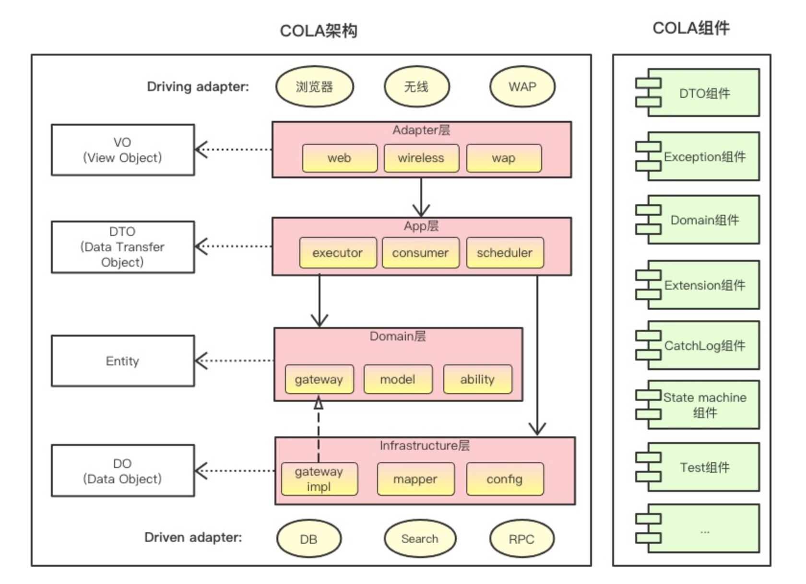

# ark-components

#### 介绍

沉淀一些非常通用实用的组件提升研发效率，以一种灵活可插拔形式引用

#### 软件架构

参考`COLA`架构


#### 组件说明

| 组件名称                              |功能|版本|
|-----------------------------------| ---- | ---- | 
| ark-component-dto                  |定义了通用|1.0.0|
| ark-component-exception            |定义了规范异常格式|1.0.0|
| ark-component-common               |通用工具组件|1.0.0|
| ark-component-validator            |校验组件|1.0.0|
| ark-component-spring-boot-starters |springboot-starters|1.0.0|

SpringBootStarter

|组件名称|功能|版本|
| ---- | ---- | ---- | 
|ark-component-logger-starter|日志处理（AOP日志拦截）|1.0.0|
|ark-component-exception-spring-boot-starter|异常处理（全局异常捕捉）|1.0.0|
|ark-component-redis-spring-boot-starter|Redis封装|1.0.0|
|ark-component-web-spring-boot-starter|单体Web应用Starter|1.0.0|

#### 使用说明

```
mvn install到本地（如果不想运行测试，可以加上-DskipTests参数）
```